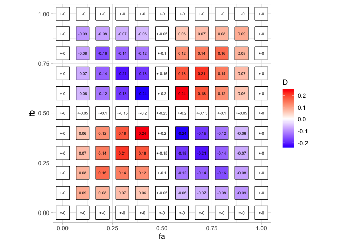

# D and D’ statistics to measure LD

When we talk about **linkage** we are always considering **two loci**.
It is important we keep this in mind. We can take as example positions
82 and 83 from the figure 6.1 from Nielsen and Slatkin book (Figure 1).
From now on, the yellow allele in position 82 is going to be denoted as
“a” and blue allele as “A”; for position 83 I’m going to call them “B”
and “b” respectively.

**Figure 1.** Figure 6.1 from Nielsen and Slatkin book. The two loci
highlighted in a red rectangle are the two taken as an example.

Let’s start by counting the haplotypes and calculate their frequency:

<table>
<thead>
<tr>
<th>Haplotypes</th>
<th>Counts</th>
<th>Frequency</th>
</tr>
</thead>
<tbody>
<tr>
<td>AB</td>
<td>22</td>
<td><em>f</em><em>A</em><em>B</em> =
22/51 = 0.43</td>
</tr>
<tr>
<td>Ab</td>
<td>9</td>
<td><em>f</em><em>A</em><em>b</em> =
9/51 = 0.18</td>
</tr>
<tr>
<td>aB</td>
<td>0</td>
<td><em>f</em><em>a</em><em>B</em> =
0/51 = 0</td>
</tr>
<tr>
<td>ab</td>
<td>20</td>
<td><em>f</em><em>a</em><em>b</em> =
20/51 = 0.39</td>
</tr>
</tbody>
</table>

and the allele frequency is:

<table>
<thead>
<tr>
<th>Allele</th>
<th>Counts</th>
<th>Frequency</th>
</tr>
</thead>
<tbody>
<tr>
<td>A</td>
<td>22+9 = 31</td>
<td><em>f</em><em>A</em> =
31/51 = 0.61</td>
</tr>
<tr>
<td>a</td>
<td>0 + 20 = 20</td>
<td><em>f</em><em>a</em> =
20/51 = 0.39</td>
</tr>
<tr>
<td>B</td>
<td>22 + 0 = 22</td>
<td><em>f</em><em>B</em> =
22/51 = 0.43</td>
</tr>
<tr>
<td>b</td>
<td>9 + 20 = 29</td>
<td><em>f</em><em>b</em> =
29/51 = 0.57</td>
</tr>
</tbody>
</table>

If we say that these two loci are linked, it means that when we observe
one allele we have a great chance to predict what allele is in the other
position. For example, we can see from the haplotype table that A comes
together with B, since AB haplotypes have a frequency of 0.43 while Ab
has only a frequency of 0.18. Thus, in a relative way, A goes 0.43/0.18
= 2.38 times more with B than with b. But how can we quantify this
linkage?

## D to measure LD

This statistic is based on **comparing the observed haplotype
frequencies** *f* **with the expected allele frequencies**
*f**E* **under the null hypothesis of independent
segregation**. From basic probability, we know that this is calculated
by multiplying the frequencies of each allele (similar to
Hardy-Weinberg):

*f**A**B**E* = *f**A**f**B*
*f**A**b**E* = *f**A**f**b*
*f**a**B**E* = *f**a**f**B*
*f**a**b**E* = *f**a**f**b*

Thus, we can compare the observed by just **subtracting the expected
frequency from the observed frequency for each haplotype**. This
quantity is known as *D*. For example, we can compute
*D**A**B* as:

*D**A**B* = *f**A**B* − *f**A**B**E*
*D**A**B* = *f**A**B* − *f**A**f**B*
*D**A**B* = 0.43 − 0.61(0.43) = 0.168

When we only have two alleles, the absolute quantity of D is the same
for all haplotypes. You can calculate yourself *D* for the other
haplotypes and you will see that:

*D**A**B* = 0.168
*D**A**b* = −0.168
*D**a**B* = −0.168
*D**a**b* = 0.168

And the fact that *D**A**B* = *D**a**b* and
*D**a**B* = *D**A**b* and
*D**A**B* = −*D**A**b* can be shown mathematically
as:

By definition:

*D**A**B* = *f**A**B* − *f**A**f**B* (1)
*D**A**b* = *f**A**b* − *f**A**f**b* (2)
*f**A* = *f**A**b* + *f**A**B* (3)
*f**A**B* = *f**A* − *f**A**b* (4)
*f**b* = *f**A**b* + *f**a**b* (5)
*f**A**b* = *f**b* − *f**a**b* (6)
*f**b* = 1 − *f**B* (7)
*f**A* = 1 − *f**a* (8)

We can show that *D**A**B* = −*D**A**b* by:

*D**A**B* = *f**A**B* − *f**A**f**B* (*s**t**a**r**t**i**n**g* *a**t* 1)
*f**A* − *f**A**b* − *f**A**f**B* (*u**s**i**n**g* 4)
−*f**A**b* + *f**A* − *f**A**f**B*
−*f**A**b* + *f**A*(1 − *f**B*)
−*f**A**b* + *f**A**f**b* (*u**s**i**n**g* 7)
−(*f**A**b* − *f**A**f**b*)
*D**A**B* = −*D**A**b* (*u**s**i**n**g* 2)

If we carry on a bit more, we can show that
*D**A**B* = *D**a**b* by:

*D**A**B* = −*D**A**b*
−*f**A**b* + *f**A**f**b*
−(*f**b* − *f**a**b*) + *f**A**f**b* (*u**s**i**n**g*6)
−(*f**b* − *f**a**b*) + (1 − *f**a*)*f**b* (*u**s**i**n**g*8)
−*f**b* + *f**a**b* + *f**b* − *f**b**f**a*
*f**a**b* − *f**a**f**b* = *D**a**b*
*D**A**B* = *D**a**b*

So, D is going to be a quantity that can only get values between 1 and
-1 (theoretically, but we will see soon that this is not true) and which
*D**A**B* = *D**a**b* and
*D**a**B* = *D**A**b* and
*D**A**B* = −*D**A**b*. In the example above, we
found that for this example we get *D* = 0.168, but is this D value high
or low?

Intuition tells us that *D* is going to be constrained by the allele
frequencies. For example, if we have that *f**a* = 0.01 and
*f**b* = 0.01, *D* can’t be very large since the observed and
expected haplotype frequencies can’t be very big and the difference is
going to be small. However, when *f**a* = 0.5 and
*f**b* = 0.5 then *D* can get larger absolute values.

To illustrate that, I compute in the next R chunk all the possible
observed haplotype frequency scenarios and from that I calculate
*D**a**b* and keep track of *f**a* and
*f**b*.

    library(tidyverse)

    ## ── Attaching core tidyverse packages ─────────────────────────────────────────────── tidyverse 2.0.0 ──
    ## ✔ dplyr     1.1.4     ✔ readr     2.1.5
    ## ✔ forcats   1.0.0     ✔ stringr   1.5.1
    ## ✔ ggplot2   3.5.1     ✔ tibble    3.2.1
    ## ✔ lubridate 1.9.3     ✔ tidyr     1.3.1
    ## ✔ purrr     1.0.2     
    ## ── Conflicts ───────────────────────────────────────────────────────────────── tidyverse_conflicts() ──
    ## ✖ dplyr::filter() masks stats::filter()
    ## ✖ dplyr::lag()    masks stats::lag()
    ## ℹ Use the conflicted package (<http://conflicted.r-lib.org/>) to force all conflicts to become errors

    fAB <- c()
    faB <- c()
    fAb <- c()
    fab <- c()
    fa  <- c()
    fb  <- c()
    D   <- c()

    for(vfAB in c(0.0, 0.1, 0.2, 0.3, 0.4, 0.5, 0.6, 0.7, 0.8, 0.9, 1.0)){
      for(vfaB in c(0.0, 0.1, 0.2, 0.3, 0.4, 0.5, 0.6, 0.7, 0.8, 0.9, 1.0)){
        for(vfAb in c(0.0, 0.1, 0.2, 0.3, 0.4, 0.5, 0.6, 0.7, 0.8, 0.9, 1.0)){
          for(vfab in c(0.0, 0.1, 0.2, 0.3, 0.4, 0.5, 0.6, 0.7, 0.8, 0.9, 1.0)){
            if(round(vfAB+vfaB+vfAb+vfab, digits = 1) == 1){
              fAB <- c(fAB, vfAB)
              faB <- c(faB, vfaB)
              fAb <- c(fAb, vfAb)
              fab <- c(fab, vfab)
              vfa <- vfaB+vfab
              vfb <- vfAb+vfab
              fa  <- c(fa, vfa)
              fb  <- c(fb, vfb)
              D   <- c(D, vfab - (vfa*vfb))
            }
          }
        }
      }
    }

    data.frame(fAB, faB,fAb,fab,fa,fb,D) %>%
      head(20)

    ##    fAB faB fAb fab  fa  fb     D
    ## 1    0 0.0 0.0 1.0 1.0 1.0  0.00
    ## 2    0 0.0 0.1 0.9 0.9 1.0  0.00
    ## 3    0 0.0 0.2 0.8 0.8 1.0  0.00
    ## 4    0 0.0 0.3 0.7 0.7 1.0  0.00
    ## 5    0 0.0 0.4 0.6 0.6 1.0  0.00
    ## 6    0 0.0 0.5 0.5 0.5 1.0  0.00
    ## 7    0 0.0 0.6 0.4 0.4 1.0  0.00
    ## 8    0 0.0 0.7 0.3 0.3 1.0  0.00
    ## 9    0 0.0 0.8 0.2 0.2 1.0  0.00
    ## 10   0 0.0 0.9 0.1 0.1 1.0  0.00
    ## 11   0 0.0 1.0 0.0 0.0 1.0  0.00
    ## 12   0 0.1 0.0 0.9 1.0 0.9  0.00
    ## 13   0 0.1 0.1 0.8 0.9 0.9 -0.01
    ## 14   0 0.1 0.2 0.7 0.8 0.9 -0.02
    ## 15   0 0.1 0.3 0.6 0.7 0.9 -0.03
    ## 16   0 0.1 0.4 0.5 0.6 0.9 -0.04
    ## 17   0 0.1 0.5 0.4 0.5 0.9 -0.05
    ## 18   0 0.1 0.6 0.3 0.4 0.9 -0.06
    ## 19   0 0.1 0.7 0.2 0.3 0.9 -0.07
    ## 20   0 0.1 0.8 0.1 0.2 0.9 -0.08

I know that for the same *f**a* and *f**b* values I can have different
combinations of the haplotype frequencies. How large can D get for a
given *f**a* and *f**b* values? For example, we take the case in which
*f**a* = 0.2 and *f**b* = 0.4.

    data.frame(fAB, faB,fAb,fab,fa,fb,D) %>%
      filter(fa == 0.2, fb == 0.4)

    ##   fAB faB fAb fab  fa  fb     D
    ## 1 0.4 0.2 0.4 0.0 0.2 0.4 -0.08
    ## 2 0.5 0.1 0.3 0.1 0.2 0.4  0.02
    ## 3 0.6 0.0 0.2 0.2 0.2 0.4  0.12

From that table we’ve calculated that the range of values for D is
\[-0.08, 0.12\]. So, in this case, the most extreme value that D can
take (calculated as
*m**a**x*(*m**a**x*(*D**a**b*), *a**b**s*(*m**i**n*(*D**a**b*))))
is 0.12. How is the landscape for all combinations of *f**a*
and *f**b*?

This is plotted in the next chunk in which I show for a given pair of
*f**a* (x-axis) and *f**b* (y-axis).

    data.frame(fAB, faB,fAb,fab,fa,fb,D) %>% 
      mutate(fa = round(fa, digits = 2), fb = round(fb, digits = 2)) %>%
      group_by(fa, fb) %>%
      summarize(maxD = round(max(D), digits = 2), minD = round(min(D), digits = 2)) %>%
      mutate(D = ifelse(minD*-1 > maxD, minD, ifelse(minD*-1 < maxD, maxD, maxD)),
             both = ifelse(minD*-1 == maxD, 0, 1)) %>%
      ggplot() +
      geom_point(aes(x = fa, y = fb, fill = D), shape = 22, size = 10) +
      geom_text(aes(x = fa, y = fb, label = round(D, digits = 2)), size = 2) +
      geom_point(data = . %>% filter(both == 0), aes(x = fa, y = fb), fill = "white", shape = 22, size = 10) +
      geom_text(data = . %>% filter(both == 0), aes(x = fa, y = fb, label = paste("+-", round(D, digits = 2), sep = "")), size = 2) +
      scale_fill_gradient2(low = "blue", high = "red", mid = "white", midpoint = 0) +
      theme_light() +
      theme(aspect.ratio = 1)

    ## `summarise()` has grouped output by 'fa'. You can override using the `.groups` argument.

We can see that there are some constrains. For example, when
*f**a* = 0.1 and *f**b* = 0.1 we see that most
extreme value of *D**a**b* is 0.09, but when
*f**a* = 0.5 and *f**b* = 0.5 then
*D**a**b* can get either positive or negative 0.25. This
tells us that **depending of the allele frequency,** *D* **is going to
be constrained**. We also see that the greatest value *D* can get is
0.25 or -0.25 (instead of 1 that we though before).

So, if we say that we cheeked two alleles and they are in linkage with
*D* = 0.168 are they in high or low LD?

## D’ to measure LD

What we can do is to compare D to the most extreme value that D can take
according to the allele frequencies. But… is there a way to compute the
range of values that D can take in an easy way?

The answer is yes! We can put upper and lower boundaries to D with the
following reasoning:

We know from before that *D**A**B* = *D**a**b* and
*D**a**B* = *D**A**b* and
*D**A**B* = −*D**A**b*. If we assume that
*D**A**B* = *D* and that D is positive

*D* = *f**A**B* − *f**A**f**B*
*f**A**B* = *f**A**f**B* + *D*

Then:

*f**A**b* = *f**A**f**b* − *D*
*f**a**B* = *f**a**f**B* − *D*
*f**a**b* = *f**a**f**b* + *D*

Imagine now we don’t know *D*, how positive *D* can be?Well, if we look
at these two formulas we just derived:

*f**A**b* = *f**A**f**b* − *D*
*f**a**B* = *f**a**f**B* − *D*

we see that *D* can’t be bigger than *f**A**f**b*
or *f**a**f**B*, because otherwise
*f**A**b* or *f**a**B* are going to be &lt; 0,
which can’t happen (the frequency of a haplotype can’t be negative,
right?). Thus, we just defined an upper limit: *D* can’t be bigger than
any of *f**A**f**b* or
*f**a**f**B*. so:

*D* ≤ *m**i**n*(*f**A**f**b*, *f**a**f**B*)

Now, let’s assume that *D* is negative. Similarly to what we’ve just
done, if we look at:

*f**A**B* = *f**A**f**B* + *D*
*f**a**b* = *f**a**f**b* + *D*

and knowing that *D* &lt; 0, let’s say *D* = −*x* (x&gt;0):

*f**A**B* = *f**A**f**B* − *x*
*f**a**b* = *f**a**f**b* − *x*

How negative *D* can be?

Well, since *D* can’t be bigger than *f**A**f**B*
or *f**a**f**b*, because otherwise
*f**A**B* or *f**a**b* are going to be &lt; 0,
which can’t happen. Thus, we just defined an lower limit:
*a**b**s*(−*D*) can’t be bigger than any of
*f**A**f**B* or
*f**a**f**b*. so:

*D* ≥ −*m**i**n*(*f**A**f**B*, *f**a**f**b*)

You might see that this is different from the formula you have in the
book, but you can get the one on the book by:

−*D* ≤ *m**i**n*(*f**A**f**B*, *f**a**f**b*)

So, from the example we started with, we get that

−*m**i**n*(*f**A**f**B*, *f**a**f**b*) ≤ *D* ≤ *m**i**n*(*f**A**f**b*, *f**a**f**B*)

−*m**i**n*(0.26, 0.22) ≤ *D* ≤ *m**i**n*(0.168, 0.348)

−0.22 ≤ *D* ≤ 0.168

An here is where things get a bit complicated and confused.

On the book it is said:

> To describe the extent of LD in a way that takes the range of possible
> values into account, we define *D*′ to be the ratio of |*D*| to its
> **maximum possible value**:
>
> $$
> D' = \frac{D}{min(f\_Af\_b, f\_af\_B)}\\if\\D &gt; 0  
> $$
> $$
> D' = \frac{-D}{min(f\_Af\_B, f\_af\_b)}\\if\\D &lt; 0  
> $$

Then, I firstly interpret that the maximum possible value in the
previous calculated range of values for *D* is 0.22. But then:

$$
D' = \frac{0.168}{0.22} = 0.763 
$$

which is different from the solution provided by the book *D*′ = 1.

Then, I tried to calculate *D*′ using the two formulas provided:

$$
D' = \frac{0.168}{0.168} = 1\\\\if\\D &gt; 0  
$$
$$
D' = \frac{0.168}{0.22} = 0.763\\\\if\\D &lt; 0  
$$

So… depending on which formula we use (arbitrarily choosing *D* &gt; 0
or *D* &lt; 0) we get different results for *D*′; one being correct and
the other being incorrect.

To explain why this is I have two explanations:

#### 1

If you read again what the book says, you will see that it says that
|*D*| has to be contrasted to the “maximum POSSIBLE value”. Then, I
asked myself, is possible that *D* = 0.22? From previous formulas in
which we obtained the boundaries for *D* we know that:

*f**a**B* = *f**a**f**B* − *D*

So, from the data provided we get that:

0 = 0.168 − *D*

Is it possible that *D* = 0.22 NO! because then 0 = −0, 052. But is it
possible that *D* = 0.168? Yes! Because there is no other constrain
preventing it and 0 = 0. Therefore, the maximum POSSIBLE value of *D* is
0.168.

#### 2

There are some details in the derivation of the formulas that we don’t
get from the book because it is too complicated. One aspect I’ve found
[here](https://cs.brown.edu/courses/csci2951-n/resources/AACB2014-IntroLinkageDisequilibrium.pdf)
is that *D* has an actual definition, that is not just one
*D**A**B*, *D**a**B*, *D**A**b**o**r**D**a**b*.

Basically, *D* = *D**A**B* = *D**a**b* in the
condition that the allele A is the one that has more counts for that
particular loci (so A &gt; a) and the same with loci B/b (B&gt;b). Then,
the formulas we obtained before about *D* &gt; 0 or *D* &lt; 0 fit our
example and everything is perfect!

Overall, what you should know is that:

1.  *D* is the difference between the observed haplotype frequency and
    the expected (under the null hypotesis of independence of
    segregation among loci):

*D**A**B* = *f**A**B* − *f**A**f**B*

1.  *D* is constrained depending on the allele frequencies
    (*f**a* and *f**b*) and a value of *D* might
    mean a lot of linkage for a certain frequency values and might also
    mean very few linkage for other frequency values.

2.  A way to deal with this problem is to correct for the maximum
    possible value that *D* can have depending on the frequency values.
    This is known as *D*′ and can get values from \[0-1\]. In a way, is
    a proportion that tell us how much linkage you observe out of the
    maximum possible linkage you can get.

    $$
    D' = \frac{D}{max(D)}
    $$

Hope this was helpful!
